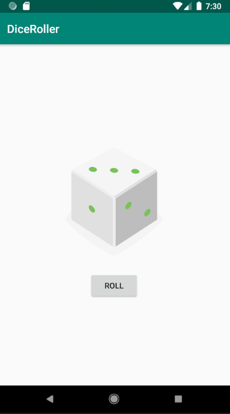

# Dice Roller - Udacity Kurs
Eine kleine Applikation in der man einen Würfel "werfen" kann.     
Philipp Auinger, 5BHIF am 30.09.2019

## Anmerkung
Jede Änderung am Code (Punkt "Exercise" im Kurs) wurde durch einen COMMIT gekennzeichnet.

## Was habe ich gelernt?
- Setup Android Studio
- Setup device or emulator
- Basic app structure
- Layouts, Activities and Inflation
- Interaction via Button
- Gradle & Compatibility on Android

## User-Interface

